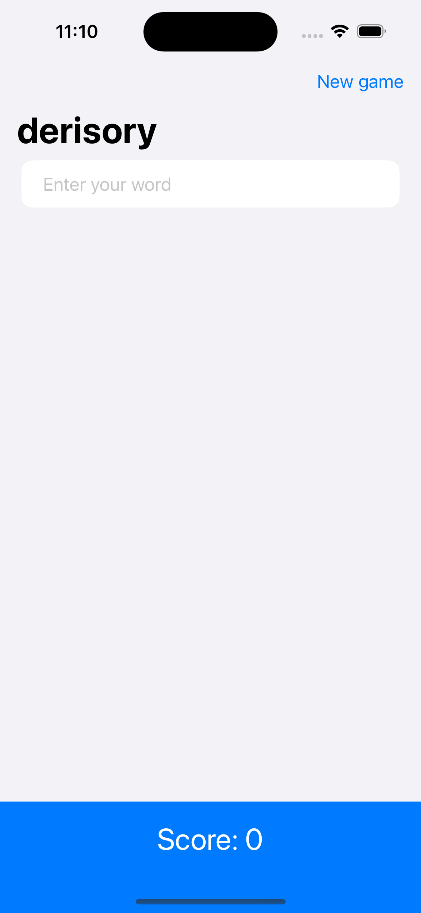
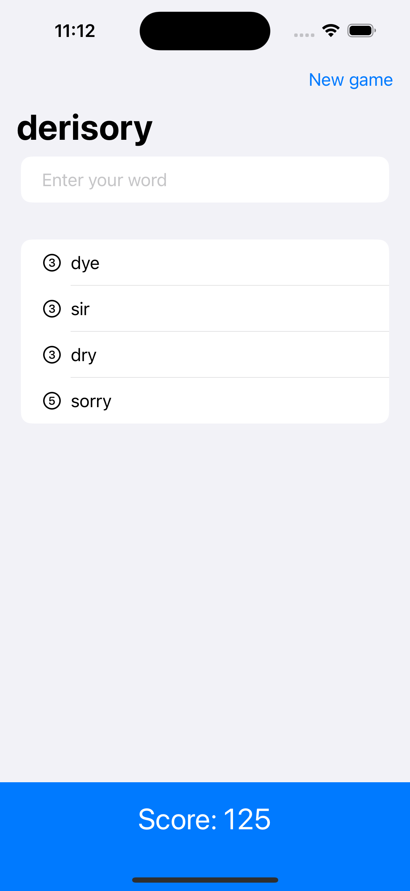
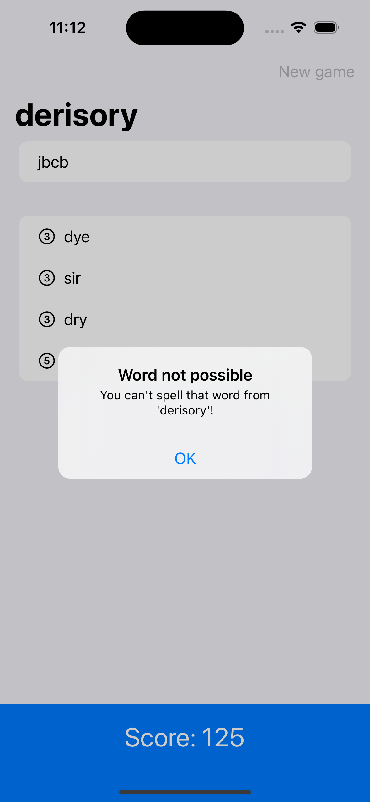

# WordScramble

WordScramble is an engaging iOS word game built using SwiftUI, where players form as many words as possible from a given root word. It encourages players to explore their vocabulary, offering points for each unique word created, and provides instant feedback on the validity of the words.

    
    
    

## Features

- **Word Formation**: Players input words using letters from a provided root word.
- **Scoring System**: Points are awarded based on the length of the words.
- **Instant Feedback**: Players receive immediate notification if the word is valid, already used, or incorrect.

## How to Play

1. Launch the app to see a randomly selected root word.
2. Enter words that can be formed from the letters of the root word.
3. Submit each word to earn points based on its length.
4. Start a new game at any time to play with a different root word.

## Technologies Used

- **SwiftUI**: Used for building the user interface and handling user interactions.
- **Swift**: The programming language used to implement the game logic.
- **Xcode**: The integrated development environment used for iOS app development.

## Getting Started

To run this project locally, you'll need:

- Ensure Xcode is installed on your Mac.
- Clone this repository to your local machine.
- Open the project in Xcode.
- Build and run the project on a simulator or your iOS device.

## Credits

This project is part of the ["100 Days of SwiftUI"](https://www.hackingwithswift.com/100/swiftui) course by Paul Hudson. I learned how to build this game and further develop my SwiftUI skills through the course.

## Learning Experience

Creating WordScramble provided me with valuable experience in SwiftUI and reinforced my understanding of handling user input, processing data, and updating the UI in response to user actions. In addition to following the main project instructions, I completed extra challenges provided at the end of the course where there were no instructions.
